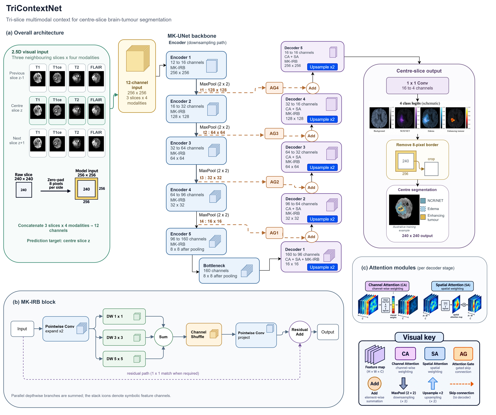

# TriContextNet

**Tri-slice multimodal context for centre-slice brain-tumour segmentation.**

This repository provides the TriContextNet implementation, the exact trained checkpoint used in the study, model configurations, preprocessing, inference and evaluation entrypoints, and frozen aggregate results for BraTS 2020.



*TriContextNet architecture. Skips are taken after pooling: t1=16×128×128, t2=32×64×64, t3=64×32×32 and t4=96×16×16 (channels×height×width). Decoder dimensions are after upsampling. Attention insets are simplified schematics: channel attention combines global average/max pooling through shared transformations; spatial attention uses channel-wise average/max aggregation before a 7×7 convolution; each gate is conditioned on the upsampled decoder feature. Encoder 5's 8×8 label includes its pooling operation and denotes the same tensor shown as the bottleneck.*

## Method

TriContextNet concatenates four MRI modalities (T1, T1ce, T2, FLAIR) from the ordered axial slices z−1, z, z+1 into a **12-channel input** and predicts the **centre slice**. It retains the pinned MK-UNet backbone with widths 16/32/64/96/160 and adapts its input width. It does not introduce a separate fusion block or auxiliary deep-supervision loss. The implementation contains **317,438 parameters** and requires **0.413568384 GFLOPs** per centre-slice prediction under the study's MAC-style counting convention (one multiply-accumulate counted as one FLOP).

The MK-UNet lineage and other upstream implementations are documented in [THIRD_PARTY_NOTICES.md](THIRD_PARTY_NOTICES.md).

## Installation and environment

Run commands from the repository root using Python 3.12:

```bash
git clone https://github.com/Qusai-Hourani/TriContextNet.git
cd TriContextNet
python -m venv .venv
# Activate .venv using your operating system's usual command.
python -m pip install -r requirements.txt
python scripts/verify_artifacts.py
```

Artifact verification checks byte sizes and SHA256 hashes without loading a model. The historical TriContextNet runtime used Python 3.12.13, PyTorch 2.10.0+cu128, TorchVision 0.25.0+cu128, NumPy 2.0.2, NiBabel 5.4.2, CUDA 12.8 and a Tesla T4. Select the appropriate PyTorch wheel for your platform. [Environment details and validation limits](docs/ENVIRONMENT.md).

## Data setup and preprocessing

Obtain BraTS 2020 through the [official registration/data request process](https://www.med.upenn.edu/cbica/brats2020/registration.html), follow the provider's [data terms and citation requirements](https://www.med.upenn.edu/cbica/brats2020/data.html), and use data you are authorized to process. MRI volumes and subject split lists are not distributed here.

```bash
python scripts/download_or_verify_data.py
python scripts/download_or_verify_data.py --t1 data/case/t1.nii.gz --t1ce data/case/t1ce.nii.gz --t2 data/case/t2.nii.gz --flair data/case/flair.nii.gz
```

The first command prints official acquisition instructions; the second checks the four supplied image headers. It does not download restricted data. Inputs must be aligned BraTS-preprocessed 240×240×155 volumes at 1 mm spacing.

Each modality is normalized over its full volume's nonzero voxels, retaining zero background. Neighbours are clamped at volume boundaries. Channels are ordered by slice, then T1/T1ce/T2/FLAIR. Eight-pixel zero padding produces `[B,12,256,256]`. [Exact preprocessing and output-label definitions](docs/PREPROCESSING.md).

## Model and trained checkpoint

| Item | Value |
|---|---|
| Source | [src/models/tricontextnet.py](src/models/tricontextnet.py) |
| Configuration | [configs/tricontextnet.json](configs/tricontextnet.json) |
| Checkpoint | [checkpoints/tricontextnet/best_model.pth](checkpoints/tricontextnet/best_model.pth) |
| Size | 1,475,367 bytes |
| Selected epoch | 37 |
| SHA256 | `725928D75D3B852D5096564E3B1DE63EB8E52912C8284B8D680490022CEEFF2A` |

Weights are committed directly to Git; no Git LFS or separate release download is required. The loader verifies the checkpoint hash, architecture identity and state-dictionary compatibility.

```python
from src.models.tricontextnet import load_tricontextnet
model = load_tricontextnet("checkpoints/tricontextnet/best_model.pth", "cpu")
# For normalized FP32 input x of shape [B,12,256,256]:
# logits = model(x)[0]  # [B,4,256,256], centre-slice logits
```

## Inference

```bash
python scripts/run_tricontextnet_inference.py --checkpoint checkpoints/tricontextnet/best_model.pth --t1 data/case/t1.nii.gz --t1ce data/case/t1ce.nii.gz --t2 data/case/t2.nii.gz --flair data/case/flair.nii.gz --output outputs/segmentation.nii.gz --device cpu
```

Use `--device cuda:0 --batch-size 16` for the historical device/batch convention. Inference uses FP32 logits, argmax, removal of the eight-pixel border, and output labels 0/1/2/4. No test-time augmentation or postprocessing is applied. CPU and other hardware outputs are not claimed to be bitwise identical to the historical T4 run. Example paths refer to your own data.

## Evaluation

Create a local CSV with columns `prediction,target` containing paths relative to that CSV, then run:

```bash
python scripts/evaluate_predictions.py --pairs data/my_pairs.csv --output outputs/my_aggregate_metrics.json
```

The evaluator reconstructs no identities and reports aggregate 3D WT/TC/ET Dice and HD95 using the frozen metric definitions. It evaluates only explicitly supplied label volumes. [Metric conventions and reproducibility scope](docs/REPRODUCIBILITY.md).

## Frozen results

| Cohort | WT Dice | TC Dice | ET Dice | Overall mean Dice |
|---|---:|---:|---:|---:|
| Validation | 0.8972394977230269 | 0.8116878666054717 | 0.8232392056721225 | 0.8440555233335404 |
| Held-out | 0.8879476493633927 | 0.8355034077040552 | 0.7580310384453216 | 0.8271606985042564 |

The study used a fixed 295/37/37 train/validation/held-out partition of 369 labelled BraTS 2020 training cases. The held-out cohort is an internal split, not the official challenge test set. MK-UNet's held-out overall Dice was 0.8265687786102657; the observed difference is small and descriptive, with no statistical-superiority claim. **TriContextNet validation HD95 remains NA.**

[Frozen model comparison](tables/frozen_model_comparison.csv) · [Controlled context ablation](tables/frozen_context_ablation.csv) · [Aggregate figures](figures/README.md)

## Benchmark adapters and checkpoints

Adapters/configs cover MK-UNet, standard 2D U-Net, Attention U-Net, DeepLabV3+, TinyU-Net, Rolling-Unet-S, base CMUNeXt, Mobile U-ViT, U-KAN and MSMamba. The original project-trained Rolling-Unet-S, base CMUNeXt and TinyU-Net checkpoints are included under `checkpoints/benchmarks/`.

[MODEL_MANIFEST.json](checkpoints/MODEL_MANIFEST.json) records checkpoint names, sizes, hashes, configs and distribution status. [Model loading instructions](docs/MODELS.md) describe outputs and benchmark runtime qualifications. U-KAN and MSMamba source must be obtained separately at the pinned revisions in [THIRD_PARTY_NOTICES.md](THIRD_PARTY_NOTICES.md). Seven other original checkpoints are omitted because their serialized metadata contains personal paths; their identities and aggregate results remain documented.

## Reproducibility and limitations

The checkpoint and frozen numeric result strings are unchanged. [Reproducibility notes](docs/REPRODUCIBILITY.md) describe training settings, metric definitions and source identities. Exact replication of the original training trajectory is limited by unavailable private split identities and continuation state. The portable scripts received static syntax/import checks; inference and metric evaluation were not executed during release preparation.

This is a research model, not a clinical device. Evidence is limited to the reported dataset and split; external validation, calibration, demographic subgroup analysis and prospective clinical evaluation have not been established. See the [model card](docs/MODEL_CARD.md).

## Citation and attribution

If you use this repository, please cite the associated TriContextNet paper once published. Until paper metadata is available, identify this repository URL and the exact commit and checkpoint hash used. No paper DOI or final author list is asserted here.

Please also cite the underlying MK-UNet method and BraTS dataset publications. [Third-party attribution and pinned sources](THIRD_PARTY_NOTICES.md) · [Dataset citations](docs/PREPROCESSING.md#dataset-citations)
